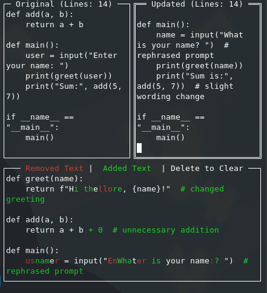

# ✨ DiffTerm

**DiffTerm** is a terminal-based, side-by-side text diff tool designed for developers who work in the terminal—especially those collaborating with AI.  
I created DiffTerm after noticing that AI-generated code often contains subtle mistakes or deviations from instructions. With DiffTerm, you can instantly compare two text blocks and visually spot changes at a glance—making AI-assisted coding safer, faster, and more reliable.



---

## 🚩 Why DiffTerm?

When coding in the terminal with AI, it's common to get code suggestions or completions that aren't exactly what you intended.  
**DiffTerm** lets you:
- Instantly paste and compare original and AI-generated code.
- See additions and deletions with clear color highlights, right in your terminal.
- Quickly verify if the AI followed your instructions, line by line.

---

## ✨ Features

- **Side-by-side Editing:**  
  Two panes for "Original" and "Updated" text, each with live line counting.
- **Live Diff Visualization:**  
  The bottom panel instantly shows the diff, with <span style="color: red; font-weight: bold;">removed</span> and <span style="color: green; font-weight: bold;">added</span> text.
- **Intuitive Controls:**
  - <kbd>TAB</kbd>: Switch panes
  - <kbd>Delete</kbd>: Clear both panes and diff
  - <kbd>Ctrl+C</kbd> or <kbd>Esc</kbd>: Exit
- **Mouse Support:**  
  Full mouse and keyboard interaction.
- **Paste Support:**  
  Paste large chunks of text with ease.
- **Legend:**  
  Always-visible color legend for clarity.

---

## 🎨 How Diff Colors Display

- <span style="color: red; font-weight: bold;">Red text</span> = Removed text
- <span style="color: green; font-weight: bold;">Green text</span> = Added text

> (If your Markdown viewer doesn’t support color, you’ll see regular text. In the terminal, colors are always shown.)

---

## 🚀 Getting Started

### Prerequisites

- Go 1.19+ (or newer)

### Install dependencies

```sh
go get github.com/rivo/tview
go get github.com/gdamore/tcell/v2
go get github.com/sergi/go-diff/diffmatchpatch
```

### Build & Run

```sh
go run main.go
```
or
```sh
go build -o diffterm && ./diffterm
```

---

## 🖥️ Usage

1. Type or paste text into the "Original" and "Updated" panes.
2. See differences live in the bottom panel.
3. Use <kbd>TAB</kbd> to switch focus, <kbd>Delete</kbd> to clear, <kbd>Ctrl+C</kbd>/<kbd>Esc</kbd> to quit.

---

## 🖼️ Screenshot

<p align="center">
  
</p>

---

## 🛠️ Powered By

- [tview](https://github.com/rivo/tview)
- [tcell](https://github.com/gdamore/tcell)
- [go-diff](https://github.com/sergi/go-diff)
